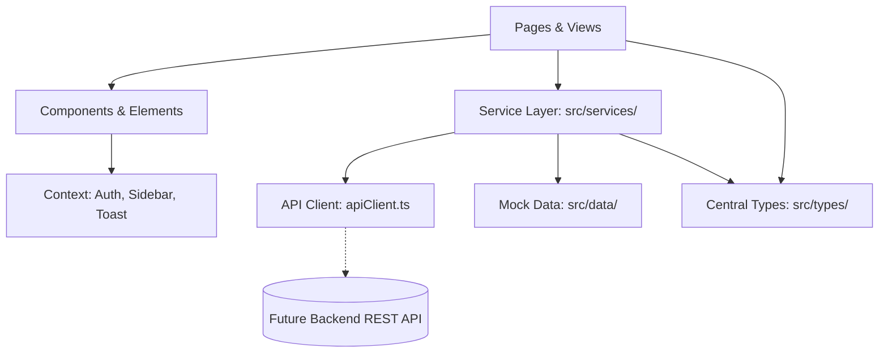

# CySKILLS-AI — Frontend Architecture & Design Specification

## 1. Architectural Philosophy & Overview

CySKILLS-AI is engineered as a modular, enterprise-ready React application. Its design emphasizes:

1. **Role-Based Polymorphism**: Seamless navigation and contextual state across three distinct user roles (`mesy`, `graduate`, `hei`).
2. **Strict Type Safety**: Fully typed domain models and API contracts across all features.
3. **Decoupled Data Architecture**: A clear separation between UI Presentation, Domain State, Service Layer, and Mock/Live API Clients.
4. **Adaptive Mobile-First Responsiveness**: Responsive UI that scales cleanly from mobile smartphones (360px) to ultra-wide displays (4K) without visual desktop regressions.



---

## 2. Directory Hierarchy

```
c:\Cyskills\src\
├── assets/                  # Static media, icons, avatars, flags
├── auth/                    # AuthProvider, useAuth, mockUsers
│   ├── AuthProvider.tsx
│   ├── mockUsers.ts
│   └── useAuth.ts
├── components/              # Complex composites, modals, layout
│   ├── Header.tsx           # Responsive header with mobile hamburger & search
│   ├── Sidenav.tsx          # Adaptive sidebar with mobile drawer & submenus
│   ├── EditProfileModal.tsx # Multi-role profile editor
│   ├── *Modal.tsx           # Modal dialogs
│   └── index.ts             # Clean component barrel
├── config/
│   └── navigation.ts        # Navigation trees & role page mappings
├── context/
│   ├── SidebarContext.tsx   # Mobile drawer visibility & toggles
│   └── ToastContext.tsx     # Global notifications & toasts
├── data/                    # Centralized mock domain datasets
│   ├── mesyData.ts
│   ├── graduateData.ts
│   ├── heiData.ts
│   ├── aiData.ts
│   └── index.ts
├── elements/                # Reusable UI primitives & widgets
│   ├── ai/                  # Chat assistant widgets
│   ├── Button.tsx
│   ├── Card.tsx
│   ├── DataTable.tsx        # TanStack Table engine with filters & pagination
│   ├── Modal.tsx            # Base accessible modal
│   ├── TrendChart.tsx       # SVG Line/Trend visualizer
│   ├── CurriculumTrendChart.tsx
│   └── index.ts             # Clean elements barrel
├── pages/                   # Role page views
│   ├── graduate/            # Student/Graduate pages
│   ├── hei/                 # Higher Education Institution pages
│   └── mesy/                # Ministry/Government pages
├── services/                # API Client & Domain Services
│   ├── apiClient.ts         # Base fetch wrapper with auth header injection
│   ├── authService.ts       # Auth methods
│   ├── mesyService.ts       # National intelligence methods
│   ├── graduateService.ts   # Career & job matching methods
│   ├── heiService.ts        # Curriculum alignment methods
│   ├── aiService.ts         # LLM interaction methods
│   ├── reportService.ts     # PDF & export generation methods
│   └── index.ts
├── types/                   # Central TypeScript contracts
│   ├── api.ts
│   ├── auth.ts
│   ├── graduate.ts
│   ├── hei.ts
│   ├── mesy.ts
│   ├── navigation.ts
│   ├── reports.ts
│   ├── table.ts
│   └── index.ts
├── App.tsx                  # Root switcher & responsive layout shell
└── main.tsx                 # Providers mounting & bootstrap
```

---

## 3. Core State Management & Data Flow

### 3.1. Authentication & Session State
* Managed via `AuthProvider` using `@tanstack/react-query` query cache.
* Persisted in `sessionStorage` under the key `"cyskills_auth_user"`.
* Supports instantaneous role switching with demo accounts: `mesy@gov.cy`, `andreas@ucy.ac.cy`, and `admin@ucy.ac.cy`.

### 3.2. Responsive Sidebar Drawer
* Managed via `SidebarContext` and `useSidebar()`.
* On screens `< 1024px` (`< lg`), the sidebar is hidden off-screen (`-translate-x-full`) and slides in over a darkened backdrop upon tapping the hamburger icon in `Header.tsx`.
* On screens `>= 1024px` (`>= lg`), the sidebar renders statically in the main layout (`lg:static lg:translate-x-0`).

### 3.3. Asynchronous Data Handling
* All async operations communicate through typed service methods in `src/services/`.
* Mock services utilize `simulateDelay()` to emulate real network latencies (200ms–750ms).
* Errors are caught and structured according to the `ApiError` interface (`{ statusCode, message, errors }`).

---

## 4. UI/UX Responsiveness Strategy

| Viewport | Breakpoint | Sidebar Behavior | Grid Layouts | Modal Behavior | Chart Behavior |
| :--- | :--- | :--- | :--- | :--- | :--- |
| **Mobile** | `< 640px` | Overlay Drawer (`z-50`) | 1 Column (`grid-cols-1`) | Full width (`w-full`) with padding | Horizontal auto-scroll |
| **Tablet** | `640px – 1023px` | Overlay Drawer (`z-50`) | 2 Columns (`sm:grid-cols-2`) | `max-w-lg` | Horizontal auto-scroll |
| **Laptop** | `1024px – 1279px`| Static left sidebar (`w-64`) | 3 Columns (`lg:grid-cols-3`)| `max-w-2xl` | Auto-scaling SVG |
| **Desktop**| `1280px+` | Static left sidebar (`w-64`) | 4 Columns (`xl:grid-cols-4`)| `max-w-2xl` / `max-w-4xl` | Auto-scaling SVG |

---

## 5. Coding Standards & Best Practices

1. **Zero Unused Symbols**: Strict adherence to TypeScript compiler flags (`noUnusedLocals: true`, `noUnusedParameters: true`).
2. **Accessibility**: Form controls feature explicit `<label>` bindings, aria attributes, and keyboard navigation support.
3. **Immutability**: All state updates utilize immutable patterns and pure functional transforms.
4. **Clean Exports**: Direct imports supported via barrel files (`src/types`, `src/services`, `src/data`, `src/elements`, `src/components`).

